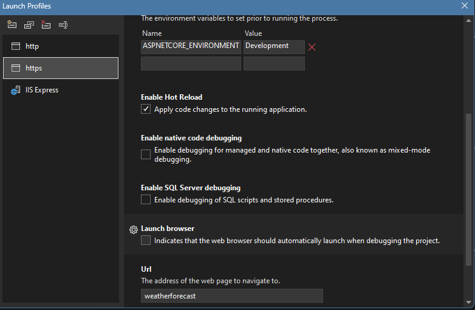

# Svelte.NetCore
Svelte 5 Front End / .NET Core Backend

## Libraries Used

### Svelte Frontend
- Svelte 5
- SvelteKit 
- Vite (for building)
- TypeScript 
- Tailwind CSS


### .NET Core Backend
- ASP.NET Core Web API


## Getting Started

### Prerequisites
- Node.js (version 20.X or higher)
- .NET Core SDK (version 8.X or higher)
- [Any other prerequisites]

### Setup and Run

1. Clone the repository:
   ```
   git clone https://github.com/your-username/Svelte.NetCore.git
   cd Svelte.NetCore
   ```

2. Set up the Svelte frontend:
   ```
   cd Sample.Svelte
   npm install
   npm run predev
   ```

3. Set up the .NET Core backend:

    In visual studio right click on the Sample.Api project and select "properties"
    Go to the "Debug" tab
    Uncheck "Launch browser"
    
4. Run the backend:

    In visual studio right click on the Sample.Api project and select "Set as Startup Project"

5. In a new terminal, run the frontend:
   ```
   cd ../ClientApp
   npm run dev
   ```

6. Open your browser and navigate to `http://localhost:5000` (or the port specified in your Svelte config).

## Development

[Add any specific development instructions or guidelines]

## Building for Production

[Add instructions for building and deploying the project]

## Contributing

[Add contribution guidelines if applicable]

## License

[Specify the license for your project]
